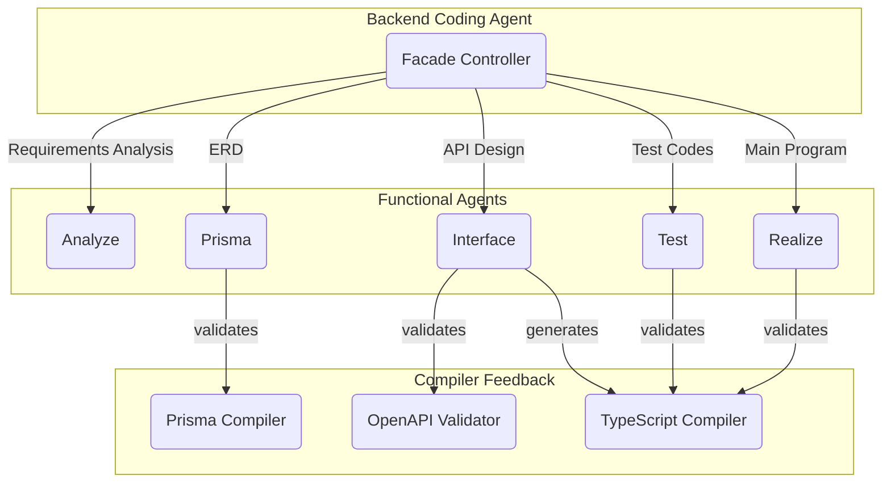

## 1. AutoBE 소개

- Github Repository: https://github.com/wrtnlabs/autobe
- Guide Documents: https://autobe.dev

뤼튼테크놀로지에서 AutoBE 오픈소스 개발자를 모집합니다.

AutoBE는 자연어 대화만으로 프로덕션 레디 백엔드 애플리케이션을 자동 생성하는 오픈소스 AI 시스템입니다. 사용자가 채팅을 통해 AI와 요구사항을 논의하면, AutoBE가 요구사항 분석부터 데이터베이스 설계, API 명세, E2E 테스트, 구현까지 완전한 TypeScript + NestJS + Prisma 백엔드를 생성합니다.

현재 베타 단계를 완료하여 100% 컴파일 성공률을 달성했습니다. 지금은 감마 로드맵을 통해 프로토타입 수준의 새로운 기능들을 빠르게 개발하고 있으며, 향후에는 컴파일러를 확장하여 Python, Java, Go 등 다양한 언어와 프레임워크로도 백엔드를 생성할 계획입니다.

신규 채용 인원들과 함께 AutoBE를 실전에서 사용 가능한 도구로 만들어가고자 합니다.

- 작성일: 2025-11-06
- 모집처: 추후 공지

## 2. 주요 업무

- AI 에이전트 시스템 개발 및 프롬프트 최적화
- AI 친화적 컴파일러 설계 및 진단 시스템 구축
- 타입 안전한 이벤트 드리븐 아키텍처 구현
- RAG 최적화를 통한 토큰 효율화
- 생성 코드의 모듈화 및 유지보수성 개선

감마 로드맵의 프로토타입 기능들을 실전 수준으로 다듬는 것이 주요 업무입니다. 직접 명령어 지원, Interface 스키마 검증 강화, 이미지 이해 능력, RAG 최적화, 모듈화, 점진적 개선 등 6가지 핵심 영역에서 프로토타입 코드를 분석하고, 프로덕션 환경에서 안정적으로 동작하도록 개선합니다.

**AI 에이전트 시스템 개발**: 40개 이상의 전문화된 에이전트들이 협업하여 백엔드를 생성하는 오케스트레이션 시스템을 개선합니다. LLM의 의사결정을 가이드하는 시스템 프롬프트를 작성하고, Function Calling 인터페이스를 설계합니다. Interface 스키마 검증 에이전트를 관계성-보안-완전성 3단계로 분리하여 보안 취약점을 자동 탐지하는 등 에이전트 품질을 높입니다.

**AI 친화적 컴파일러 개발**: Prisma, OpenAPI, TypeScript 등 다양한 레벨의 컴파일러를 설계합니다. JSON Schema 가이드라인을 구축하여 LLM이 구조적으로 올바른 스키마를 생성하도록 돕고, 컴파일러 진단 결과를 AI 에이전트에게 피드백하여 자동으로 오류를 수정하는 Self-Healing Loop를 강화합니다.

**타입 안전한 아키텍처 구축**: 명확한 타입 설계를 통해 65개 이상의 이벤트 타입을 활용한 실시간 진행 상황 추적 시스템을 개선합니다. WebSocket 기반 RPC 시스템을 안정화하고, Discriminated Union 패턴을 활용하여 타입 안전성을 보장합니다.

**성능과 유지보수성 최적화**: RAG 시스템을 도입하여 에이전트가 필요한 정보만 선택적으로 검색하도록 개선하고, 70% 토큰 감소를 달성합니다. 생성된 코드의 중복 로직을 재사용 가능한 모듈로 리팩토링하여, 개발자가 유틸리티 함수 하나만 수정해도 전체 백엔드에 반영되도록 만듭니다.

> 위 업무를 모두 다룰 줄 알아야 하는 것은 아닙니다. AutoBE는 다양한 영역이 복합적으로 얽힌 프로젝트입니다. 모든 것을 두루 잘하는 사람도 훌륭하나, 특정 영역에서 탁월한 역량을 가진 분도 필요합니다. 
> 
> 에이전트 오케스트레이션에 특화되어 있거나, 컴파일러 설계 경험이 풍부하거나, 타입 시스템 설계에 통달했거나, RAG 최적화 전문가이거나 - 본인의 강점 영역에서 깊이 있는 기여를 해주시면 됩니다.

## 3. 자격 요건

AutoBE 자체는 TypeScript와 AI Function Calling을 활용하여 개발되었으며, AutoBE가 생성하는 백엔드 애플리케이션은 TypeScript, NestJS, Prisma 스택을 사용합니다. 그러나 이러한 특정 기술 스택을 반드시 다룰 줄 알아야 하는 것은 아닙니다.

대신 개발자로서 갖춰야 할 기본 소양과 새로운 기술을 빠르게 습득할 수 있는 능력을 중요하게 봅니다. 다음과 같은 기초 역량을 갖춘 분과 함께 일하고 싶습니다.

**필수 역량:**
- 명확한 타입 설계 능력
- 꼼꼼한 문서화 습관
- 테스트 주도 개발 경험

**명확한 타입 설계 능력**: AutoBE는 타입 안전성을 최우선으로 하는 시스템입니다. Discriminated Union, 제네릭, 타입 가드 등을 활용하여 컴파일 타임에 오류를 잡아내는 설계 철학을 이해하고 실천할 수 있어야 합니다. 특정 언어의 타입 시스템 경험보다는, 타입을 통해 안전성을 확보하려는 사고방식이 더 중요합니다.

**꼼꼼한 문서화 습관**: AutoBE는 40개 이상의 AI 에이전트가 협업하는 복잡한 시스템입니다. 각 에이전트의 역할과 상호작용을 명확히 문서화하는 능력이 필요합니다. 시스템 프롬프트, 아키텍처 문서, API 문서 작성은 AI 에이전트가 올바르게 동작하도록 가이드하는 핵심 요소입니다.

**테스트 주도 개발 경험**: AutoBE가 생성하는 백엔드는 E2E 테스트를 포함하며, AutoBE 자체도 테스트를 통해 품질을 보장합니다. 테스트를 먼저 작성하고 이를 통과하도록 구현하는 방식에 익숙해야 하며, 테스트 가능한 구조로 코드를 설계하는 능력이 필요합니다.

## 4. 우대사항

이외에 다음과 같은 추가 역량이 있으면 더욱 좋습니다.

### 4.1. 백엔드 개발 역량

- RDB에 대한 이해와 설계 역량
- API 설계 역량
- OpenAPI와 JSON Schema 스펙에 대한 이해

AutoBE는 Prisma 기반 데이터베이스 스키마와 OpenAPI 기반 API 명세를 생성하는 시스템입니다. RDB 정규화, 인덱스 설계, 관계 모델링에 대한 이해가 있다면 [Prisma 컴파일러](https://github.com/wrtnlabs/autobe/blob/main/packages/interface/src/prisma/AutoBePrisma.ts)가 생성하는 스키마의 품질을 높일 수 있습니다.

REST API 설계 원칙과 [OpenAPI 3.1 스펙](https://github.com/wrtnlabs/autobe/blob/main/packages/interface/src/openapi/AutoBeOpenApi.ts)에 익숙하다면 Interface 컴파일러가 생성하는 API 명세의 완성도를 개선할 수 있습니다. JSON Schema의 제약 조건과 검증 규칙을 이해하고 있다면 감마 로드맵의 "JSON Schema 가이드라인" 작업에도 직접 기여할 수 있습니다.

### 4.2. 에이전트 개발 역량

- 대화형 에이전트 개발 경험
- LLM 활용 경험
- Function Calling 설계 능력

AutoBE의 핵심은 40개 이상의 AI 에이전트를 [오케스트레이션](https://github.com/wrtnlabs/autobe/tree/main/packages/agent/src/orchestrate)하는 것입니다. 각 에이전트는 요구사항 분석, 데이터베이스 설계, API 명세 생성, 테스트 코드 작성, 구현 등 특정 역할을 담당하며 계층적으로 협업합니다.

이 모든 과정의 중심에는 [Function Calling](https://autobe.dev/docs/concepts/function-calling/)이 있습니다. AST 생성부터 에이전트 오케스트레이션, 각 에이전트가 만들어내는 핵심 데이터 구조까지, AutoBE 시스템 전체가 Function Calling을 통해 작동합니다. LLM이 자율적으로 적절한 함수를 선택하고 구조화된 데이터를 생성하도록 설계한 경험이 있다면, 이러한 Function Calling 기반 아키텍처를 더욱 정교하게 발전시킬 수 있습니다.

대화형 에이전트 개발 경험도 중요합니다. 사용자가 채팅을 통해 AutoBE와 요구사항을 논의하는 과정에서 사용자 의도를 정확히 파악하고, 대화 맥락을 유지하며, 자연스러운 질문-응답 흐름을 만드는 능력이 필요합니다.

마지막으로 에이전트 간 협업 패턴을 설계한 경험이 있다면 더욱 유리합니다. 에이전트 간 데이터 전달, 의존성 관리, 병렬 실행 최적화, 실패 시 재시도 전략 등의 경험은 AutoBE의 오케스트레이션 시스템을 한층 더 안정적이고 효율적으로 만드는 데 기여할 수 있습니다.

### 4.3. 프롬프트 최적화 역량

- LLM 동작을 가이드하는 최적 품질의 프롬프트 작성 능력
- 대규모 프롬프트 구조화 및 리팩토링 경험

AutoBE는 현재 메타 프롬프팅(AI에게 시스템 프롬프트 작성을 맡기는 방식)을 통해 약 [700페이지에 달하는 시스템 프롬프트](https://github.com/wrtnlabs/autobe/tree/main/packages/agent/prompts)가 작성되어 있습니다. 이러한 대규모 프롬프트를 분석하고 중복을 제거하며, 명확성을 높이고 구조를 개선하여 에이전트 품질을 향상시키는 작업이 필요합니다.

프롬프트 엔지니어링 경험이 있거나, LLM 동작 원리를 깊이 이해하고 있거나, 대규모 텍스트를 구조화한 경험이 있다면 이 영역에서 큰 기여를 할 수 있습니다.

### 4.4. 컴파일러 개발 역량

- 컴파일러 이론 및 구현 경험
- AST 설계 및 코드 생성 경험
- 다양한 프로그래밍 언어 및 프레임워크에 대한 이해

AutoBE는 현재 TypeScript + NestJS + Prisma 스택으로만 백엔드를 생성하지만, 향후 Python (FastAPI), Java/Kotlin (Spring Framework) 등 다양한 언어와 프레임워크로 확장할 계획입니다. 컴파일러 이론과 구현 경험, AST 설계 및 코드 생성 경험, 여러 프로그래밍 언어에 대한 깊은 이해가 있다면 AutoBE의 컴파일러 확장 작업에 기여할 수 있습니다.

특히 언어 중립적 AST를 설계하고 이를 다양한 언어로 변환하는 경험이 있다면 큰 도움이 됩니다.

> 현재 AutoBE 의 언어 중립적 AST 구조
>
> - [`AutoBePrisma.IApplication`](https://github.com/wrtnlabs/autobe/blob/main/packages/interface/src/prisma/AutoBePrisma.ts)
> - [`AutoBeOpenApi.IDocument`](https://github.com/wrtnlabs/autobe/blob/main/packages/interface/src/openapi/AutoBeOpenApi.ts)
> - [`AutoBeTest.IFunction`](https://github.com/wrtnlabs/autobe/blob/main/packages/interface/src/test/AutoBeTest.ts)

## 5. 이력서 작성시 참고사항

**탐색 권장 자료:**
- 공식 문서: https://autobe.dev/docs
- GitHub 리포지토리: https://github.com/wrtnlabs/autobe
- 감마 로드맵: https://autobe.dev/docs/roadmap/gamma/
- 생성 예제: https://github.com/wrtnlabs/autobe-examples

지원하기 전에 AutoBE의 공식 문서와 GitHub 리포지토리를 탐색하면서 본인만의 시각으로 프로젝트를 이해해주시기 바랍니다. 감마 로드맵은 현재 진행 중인 작업들을 파악할 수 있는 좋은 참고 자료입니다.

이력서에는 단순한 기술 스택 나열보다는, 본인이 AutoBE에 어떤 기여를 할 수 있는지 구체적으로 작성해주세요. 코드베이스를 탐색하면서 발견한 문제점, 개선 아이디어, 새로운 기능 제안 등 무엇이든 환영합니다.

**시나리오 예시:**
- `packages/agent` 의 오케스트레이션 코드를 읽어보니 에이전트 간 의존성 관리가 복잡해 보입니다. 이전에 DAG 기반 워크플로우 엔진을 개발한 경험이 있어, 의존성을 명확히 표현하고 병렬 실행을 최적화하는 작업에 기여할 수 있을 것 같습니다
- 생성 예제를 보니 E2E 테스트 코드에 중복이 많아 보입니다. 테스트 팩토리 패턴을 적용하여 유지보수성을 높이고 싶습니다
- 감마 로드맵의 이미지 이해 능력에 관심이 있습니다. Vision-Language Model을 활용한 프로젝트 경험이 있어, Figma 디자인에서 컴포넌트 구조를 자동 추출하는 기능을 제안하고 싶습니다

창의적인 제안, 비판적인 분석, 구체적인 개선 방안 모두 환영합니다.
